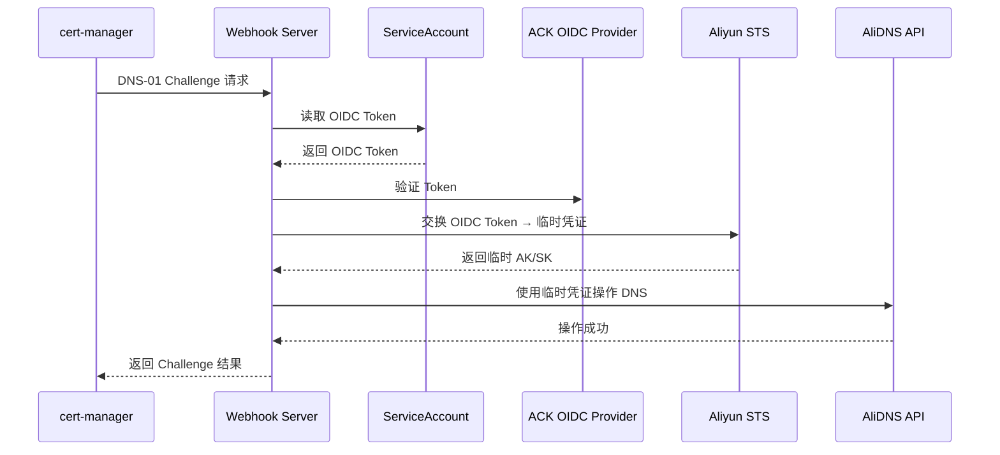
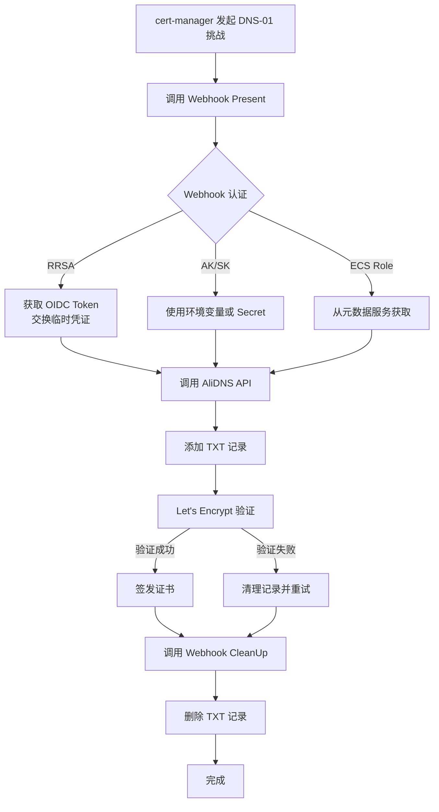

# 开发指南

本文档面向项目开发者和贡献者，介绍项目架构、开发环境设置、测试方法和发布流程。

**面向使用者？** 请查看 [README.zh-CN.md](README.zh-CN.md) 获取安装和使用指南。

---

## 目录

- [项目概述](#项目概述)
- [架构设计](#架构设计)
- [开发环境](#开发环境)
- [故障排查](#故障排查)
- [测试指南](#测试指南)
- [参考资源](#参考资源)

---

## 项目概述

本项目基于 [cert-manager/webhook-example](https://github.com/cert-manager/webhook-example) 模板，开发适用于阿里云 DNS (AliDNS) 的 cert-manager webhook。

### 核心特性

- ✅ 支持 **RRSA** (RAM Roles for Service Accounts) - 生产环境推荐
- ✅ 支持 **AccessKey/SecretKey** - 开发/测试环境
- ✅ 支持 **ECS 实例 RAM 角色** - ACK 自动支持
- ✅ 使用 **V2.0 Tea SDK** - 官方推荐版本
- ✅ **幂等性** DNS 记录管理
- ✅ **Helm Chart** 一键部署

### 设计理念

与社区其他方案不同，本项目采用了 **基础设施即身份 (Infrastructure as Identity)** 的设计理念：

| 特性                 | 传统方案                   | 本项目                     |
| :------------------- | :------------------------- | :------------------------- |
| **认证配置位置**     | Issuer/ClusterIssuer 中    | Webhook Server 自身        |
| **AK/SK 硬编码风险** | 存在（即使使用 Secret）    | **完全消除**               |
| **RRSA 支持**        | ❌                         | ✅ **原生支持**            |
| **配置复杂度**       | 高（每个 Issuer 都要配置） | **低（一次性配置）**       |
| **多账号支持**       | 支持                       | 单账号（符合绝大多数场景） |
| **凭据轮换**         | 需要更新所有 Issuer        | 自动处理                   |

---

## 架构设计

### RRSA 认证流程

RRSA (RAM Roles for Service Accounts) 是在 ACK（阿里云 Kubernetes）上生产环境部署的推荐认证方式。



### DNS-01 挑战流程



### 认证优先级

本 webhook 使用阿里云 [`credentials-go`](https://github.com/aliyun/credentials-go) 默认凭据链，自动按以下优先级查找认证信息：

| 优先级 | 认证方式              | 配置方式                                                          | 适用场景            |
| :----: | :-------------------- | :---------------------------------------------------------------- | :------------------ |
| **1**  | **环境变量 AK/SK**    | `ALIBABA_CLOUD_ACCESS_KEY_ID` + `ALIBABA_CLOUD_ACCESS_KEY_SECRET` | 开发/测试           |
| **2**  | **RRSA (OIDC)**       | `ALIBABA_CLOUD_ROLE_ARN` + OIDC Token                             | **生产环境（ACK）** |
| **3**  | **config.json**       | `~/.aliyun/config.json`                                           | 本地开发            |
| **4**  | **ECS 实例 RAM 角色** | 元数据服务（自动获取）                                            | ACK ECS 节点        |
| **5**  | **Credentials URI**   | `ALIBABA_CLOUD_CREDENTIALS_URI`                                   | 特殊场景            |

### 项目结构

```
.
├── deploy/                                 # Kubernetes 部署资源
│   └── cert-manager-alidns-webhook/       # Helm Chart
│       ├── Chart.yaml
│       ├── values.yaml                     # Helm values 配置
│       └── templates/                      # Kubernetes 资源模板
│           ├── apiservice.yaml            # APIService 配置
│           ├── deployment.yaml            # Webhook Deployment
│           ├── pki.yaml                    # TLS 证书配置
│           ├── rbac.yaml                   # RBAC 权限配置
│           └── service.yaml                # Service 配置
├── pkg/                                    # 核心代码
│   └── alidns/                            # AliDNS 客户端和 Solver 实现
│       ├── client.go                      # SDK 客户端封装
│       ├── client_test.go
│       ├── solver.go                      # DNS-01 solver 实现
│       └── solver_test.go
├── main.go                                 # Webhook server 入口
├── main_test.go
├── Makefile                                # 构建和测试脚本
├── Dockerfile                              # 容器镜像构建
├── go.mod/go.sum                           # Go 依赖管理
├── DEVELOPMENT.md                          # 本文档
├── README.md                               # 英文使用指南
└── README.zh-CN.md                         # 中文使用指南
```

---

## 开发环境

### 环境要求

- **Go**: 1.25+
- **Docker**: 20.10+
- **Helm**: 3.0+
- **Kubernetes**: 1.19+ (用于本地测试)
- **cert-manager**: v1.19.0+

### 本地开发设置

```bash
# 1. 克隆仓库
git clone https://github.com/crazygit/cert-manager-alidns-webhook.git
cd cert-manager-alidns-webhook

# 2. 安装依赖
go mod download

# 3. 运行测试（默认只跑单元测试）
make
```

### 阿里云访问凭证配置

开发时需要配置阿里云访问凭证，支持以下方式：

#### 方式一：环境变量（推荐）

```bash
export ALIBABA_CLOUD_ACCESS_KEY_ID=your_access_key_id
export ALIBABA_CLOUD_ACCESS_KEY_SECRET=your_access_key_secret
```

#### 方式二：config.json 文件

在 `~/.aliyun/config.json` 中配置：

```json
{
  "current": "default",
  "profiles": [
    {
      "name": "default",
      "mode": "AK",
      "access_key_id": "your_access_key_id",
      "access_key_secret": "your_access_key_secret"
    }
  ]
}
```

---

## 故障排查

### 问题：OpenAPI TypeMeta 定义缺失

#### 错误日志

```
Error: error installing APIGroup for solvers: unable to get openapi models:
cannot find model definition for io.k8s.apimachinery.pkg.apis.meta.v1.TypeMeta.
If you added a new type, you may need to add +k8s:openapi-gen=true
to the package or type and run code-gen again
```

#### 问题原因

此错误发生在 **Pod 启动时**，根本原因是 **Kubernetes Go 模块版本与集群版本不匹配**。

| 项目     | 版本示例                                 |
| -------- | ---------------------------------------- |
| 项目依赖 | k8s.io/apiserver v0.35.0 (对应 K8s 1.35) |
| 目标集群 | Kubernetes v1.34.1-aliyun.1              |

当 `cmd.RunWebhookServer()` 尝试注册 API Group 时，其内部的 OpenAPI schema 定义与集群 API Server 的版本不一致，导致 TypeMeta 等核心类型定义无法正确加载。

#### 版本对应关系

Kubernetes Go 模块版本与集群版本的对应规则：

```
Kubernetes 集群版本 → Go 模块版本
v1.28.x           → k8s.io/* v0.28.x
v1.29.x           → k8s.io/* v0.29.x
v1.30.x           → k8s.io/* v0.30.x
v1.31.x           → k8s.io/* v0.31.x
v1.32.x           → k8s.io/* v0.32.x
v1.33.x           → k8s.io/* v0.33.x
v1.34.x           → k8s.io/* v0.34.x
v1.35.x           → k8s.io/* v0.35.x
```

**规则**: `Kubernetes v1.X.Y` 对应 `k8s.io/* v0.X.Y`

**注意**: Go 模块使用 `v0.x` 前缀，而非 `v1.x`。这是 Kubernetes 项目的历史遗留命名规则。

#### 解决方案

1. **查看集群版本**

```bash
kubectl version --short
# Server Version: v1.34.1-aliyun.1
```

2. **修改 go.mod**

将所有 `k8s.io/*` 依赖修改为与集群版本匹配：

```bash
# 从 v0.35.0 降级到 v0.34.1
sed -i '' 's|k8s.io/.* v0.35.0|k8s.io/client-go v0.34.1|' go.mod
```

或手动编辑 `go.mod`，将以下依赖从 `v0.35.0` 改为 `v0.34.1`：

- `k8s.io/api`
- `k8s.io/apiextensions-apiserver`
- `k8s.io/apimachinery`
- `k8s.io/apiserver`
- `k8s.io/client-go`
- `k8s.io/component-base`
- `k8s.io/kms`

3. **更新依赖**

```bash
go mod tidy
```

4. **运行测试验证（默认只跑单元测试）**

```bash
make
```

#### 本地验证

在部署到集群前，可以在本地直接运行 webhook 服务器进行验证：

```bash
# 确保已设置 kubeconfig 文件的 current-context
kubectl config current-context

# 运行 webhook 服务器（连接到真实集群）
go run main.go \
  --kubeconfig ~/.kube/config \
  --authentication-kubeconfig ~/.kube/config \
  --authorization-kubeconfig ~/.kube/config
```

**注意事项**：

- kubeconfig 文件中的 `current-context` 应指向需要部署的目标集群
- 如果使用自定义 kubeconfig 路径，请替换 `~/.kube/config` 为实际路径
- 此命令会在本地启动 webhook 服务器并尝试连接到指定集群的 API Server

如果没有问题，之前的错误信息应该不存在了。

---

## 测试指南

### 单元测试

单元测试覆盖核心 DNS 操作逻辑，使用 mock 数据，不依赖真实 API：

```bash
# 运行所有单元测试
make test-unit

# 运行特定包的测试
go test -v ./pkg/alidns/

# 查看覆盖率
go test -cover ./...
```

### 集成测试

⚠️ **注意**：

集成测试会通过 API 操作阿里云解析的域名记录，运行时最好使用一个**非生产环境**的域名测试。

#### 前置条件

- 已经有域名托管在阿里云解析
- 参考 [管理访问凭证](https://help.aliyun.com/zh/sdk/developer-reference/v2-manage-go-access-credentials)，在本地配置好了访问凭证的环境变量或 `config.json` 文件

#### 运行集成测试

```bash
# 设置测试域名（注意末尾的点）
TEST_ZONE_NAME=example.com. make test-integration
```

Makefile 会检查 `TEST_ZONE_NAME` 是否设置并校验格式（必须以点结尾）。

替换上面命令中 `example.com.` 为你当前托管在阿里云用于测试的域名（不要忘记域名后面的 `.`）。

#### 运行全部测试

```bash
make test-all
```

---

## 参考资源

### 阿里云官方文档

- [阿里云 Golang SDK 配置](https://next.api.aliyun.com/api-tools/sdk/Alidns?version=2015-01-09&language=go-tea&tab=primer-doc)
- [管理访问凭证](https://help.aliyun.com/zh/sdk/developer-reference/v2-manage-go-access-credentials)
- [Endpoint 设置](https://api.aliyun.com/product/Alidns)
- [RRSA 配置指南](https://help.aliyun.com/zh/ack/ack-managed-and-ack-dedicated/user-guide/use-rrsa-to-authorize-pods-to-access-different-cloud-services)

### Cert-Manager 资源

- [Cert-Manager 官方文档](https://cert-manager.io/docs/)
- [Creating DNS Providers](https://cert-manager.io/docs/contributing/dns-providers/)
- [Webhook Example](https://github.com/cert-manager/webhook-example)

---

## 贡献指南

欢迎贡献！请随时提交 Pull Request。

在提交 PR 前，请确保：

1. ✅ 代码通过所有测试（`make test-all`）
2. ✅ 添加了必要的单元测试
3. ✅ 更新了相关文档（如需要）

---

## 许可证

本项目采用 Apache License 2.0 许可证 - 详见 [LICENSE](LICENSE) 文件。
