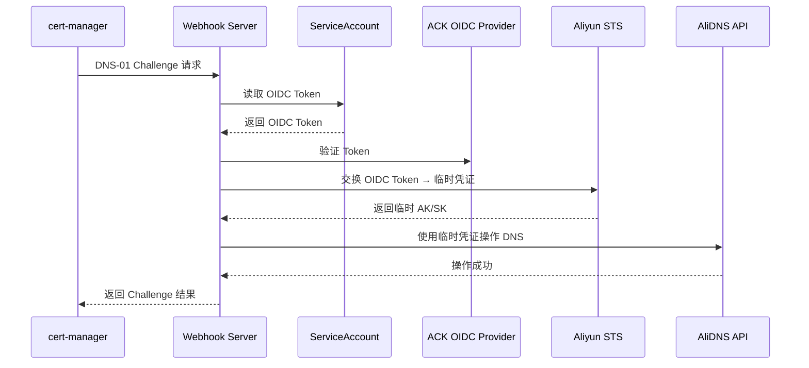
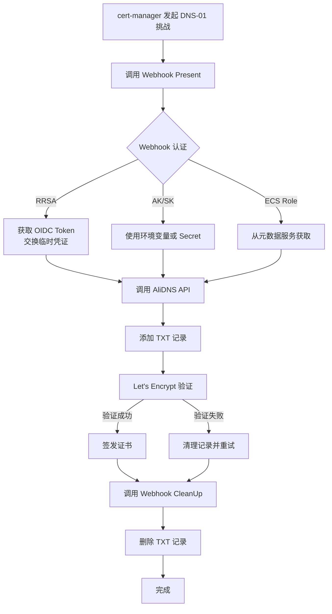

<p align="center">
  
</p>

<h1 align="center">AliDNS Webhook for cert-manager</h1>

<p align="center">
  <strong>一个为 cert-manager 提供阿里云 DNS (AliDNS) DNS-01 挑战求解的 Webhook</strong>
</p>

<p align="center">
  <a href="https://github.com/crazygit/cert-manager-alidns-webhook/actions/workflows/ci.yaml">
    
  </a>
  <a href="https://github.com/crazygit/cert-manager-alidns-webhook/releases">
    
  </a>
  <a href="https://github.com/crazygit/cert-manager-alidns-webhook/pkgs/container/cert-manager-alidns-webhook">
    
  </a>
  <a href="https://artifacthub.io/packages/helm/crazygit/alidns-webhook">
    
  </a>
  <a href="LICENSE">
    
  </a>
</p>

**简体中文** | [English](README.md)

---

## 简介

本 webhook 使 cert-manager 能够通过阿里云 DNS 服务完成 DNS-01 挑战，实现自动化 SSL/TLS 证书签发。

与社区其他方案不同，本项目采用了**基础设施即身份 (Infrastructure as Identity)** 的设计理念，通过 webhook server 自身完成认证，彻底解耦了应用配置与身份认证，支持阿里云官方 SDK 的默认凭据链。

### 核心特性

- **安全优先** - 原生支持 RRSA (OIDC)，消除静态 AK/SK 硬编码风险
- **极简配置** - Issuer 无需配置任何认证信息，零感知使用
- **多种认证** - 支持 RRSA、环境变量、Kubernetes Secret、ECS 实例角色等
- **幂等操作** - DNS 记录的添加和删除操作可安全重试
- **生产就绪** - 完整的 Helm Chart、RBAC 配置和健康检查
- **最新技术栈** - 基于最新的阿里云 Tea SDK 和 cert-manager v1.19+

---

## 为什么选择本项目？

### 设计理念对比

传统 cert-manager webhook 方案通常要求在 `Issuer` 资源中显式配置 AccessKey/SecretKey。这种做法存在以下问题：

| 特性                 | 传统方案                   | 本项目                     |
| :------------------- | :------------------------- | :------------------------- |
| **认证配置位置**     | Issuer/ClusterIssuer 中    | Webhook Server 自身        |
| **AK/SK 硬编码风险** | 存在（即使使用 Secret）    | **完全消除**               |
| **RRSA 支持**        | ❌                         | ✅ **原生支持**            |
| **配置复杂度**       | 高（每个 Issuer 都要配置） | **低（一次性配置）**       |
| **多账号支持**       | 支持                       | 单账号（符合绝大多数场景） |
| **凭据轮换**         | 需要更新所有 Issuer        | 自动处理                   |

### 本项目的优势

1.  **更高的安全性**

    - 彻底消除了静态 AK/SK 的硬编码风险
    - 原生支持 RRSA (OIDC) 等短期令牌机制

    - 完全符合云原生安全最佳实践

1.  **极致的简化**

    - 无需为每个 Issuer 重复配置凭据
    - 完全依赖阿里云 SDK 标准的默认凭据链（Default Credential Chain）
    - Issuer 配置变得极其简洁

1.  **灵活的认证**
    - 开发环境可用环境变量
    - 测试环境可用 Kubernetes Secret
    - 生产环境推荐使用 RRSA

> **注意**：此模式下，所有由该 Webhook 实例处理的 DNS 挑战都将归属于同一个阿里云账号。这一设计在简化运维的同时，完美契合绝大多数单租户或单账号管理的 Kubernetes 集群场景。

---

## 架构说明

### RRSA 认证流程



### DNS-01 挑战流程



---

## 认证方式

本 webhook 使用阿里云 [`credentials-go`](https://github.com/aliyun/credentials-go) 默认凭据链，自动按以下优先级查找认证信息：

| 优先级 | 认证方式              | 配置方式                                                          | 适用场景            |
| :----: | :-------------------- | :---------------------------------------------------------------- | :------------------ |
| **1**  | **环境变量 AK/SK**    | `ALIBABA_CLOUD_ACCESS_KEY_ID` + `ALIBABA_CLOUD_ACCESS_KEY_SECRET` | 开发/测试           |
| **2**  | **RRSA (OIDC)**       | `ALIBABA_CLOUD_ROLE_ARN` + OIDC Token                             | **生产环境（ACK）** |
| **3**  | **config.json**       | `~/.aliyun/config.json`                                           | 本地开发            |
| **4**  | **ECS 实例 RAM 角色** | 元数据服务（自动获取）                                            | ACK ECS 节点        |
| **5**  | **Credentials URI**   | `ALIBABA_CLOUD_CREDENTIALS_URI`                                   | 特殊场景            |

---

## 快速开始

### 前置条件

- Kubernetes 1.19+
- Helm 3.0+
- 已安装 cert-manager v1.19.0+
- 阿里云 DNS 账号
- 域名已托管在阿里云 DNS

### 方式一：使用 RRSA（生产环境推荐）

RRSA (RAM Roles for Service Accounts) 是在 ACK（阿里云 Kubernetes）上生产环境部署的推荐认证方式。使用前需满足以下条件：

- 需要在 ACK 集群中开启使用 RRSA 功能
- 在集群安装了`ack-pod-identity-webhook`组件
- 在部署服务的 `namespace` 资源上，设置了 labels `pod-identity.alibabacloud.com/injection: on` 或者在安装`ack-pod-identity-webhook`组件时，配置了`AutoInjectSTSEnvVars` 为 `true`

如果不清楚是否满足条件，可以参考下面的文档逐步检查：

[通过 RRSA 配置 ServiceAccount 的 RAM 权限实现 Pod 权限隔离](https://help.aliyun.com/zh/ack/ack-managed-and-ack-dedicated/user-guide/use-rrsa-to-authorize-pods-to-access-different-cloud-services)

```bash
# 3. 使用 Helm 安装 webhook
helm install cert-manager-alidns-webhook ./deploy/cert-manager-alidns-webhook \
  --namespace cert-manager \
  --create-namespace \
  --set aliyunAuth.rrsa.enabled=true \
  --set aliyunAuth.rrsa.roleName="<ROLE_NAME>"
```

**注意**：

请将 `<ROLE_NAME>` 替换为你的 RAM 角色名称（不是完整的 ARN）。确保该角色已授予操作阿里云云解析服务的权限。

```json
{
  "Version" : "1",
  "Statement" : [
    {
      "Action" : "alidns:AddDomainRecord",
      "Resource" : "*",
      "Effect" : "Allow"
    },
    {
      "Action" : "alidns:DeleteDomainRecord",
      "Resource" : "*",
      "Effect" : "Allow"
    },
    {
      "Action" : "alidns:UpdateDomainRecord",
      "Resource" : "*",
      "Effect" : "Allow"
    },
    {
      "Action" : "alidns:DescribeDomainRecords",
      "Resource" : "*",
      "Effect" : "Allow"
    },
    {
      "Action" : "alidns:DescribeDomains",
      "Resource" : "*",
      "Effect" : "Allow"
    }
  ]
}
```

### 方式二：使用 AccessKey（仅用于测试）

<details>
<summary>展开查看 AccessKey 配置方法</summary>

对于测试或非生产环境，可以使用 AccessKey 认证：

```bash
# 方式 1: 直接传入值（不推荐用于生产环境）
helm install cert-manager-alidns-webhook ./deploy/cert-manager-alidns-webhook \
  --namespace cert-manager \
  --set aliyunAuth.accessKeyID=<YOUR_ACCESS_KEY_ID> \
  --set aliyunAuth.accessKeySecret=<YOUR_ACCESS_KEY_SECRET>

# 方式 2: 使用现有 Secret（更安全）
kubectl create secret generic alidns-credentials \
  --from-literal=accessKeyID=<YOUR_ACCESS_KEY_ID> \
  --from-literal=accessKeySecret=<YOUR_ACCESS_KEY_SECRET>

helm install cert-manager-alidns-webhook ./deploy/cert-manager-alidns-webhook \
  --namespace cert-manager \
  --set aliyunAuth.existingSecret=alidns-credentials
```

</details>

### 方式三：在 ACK ECS 上使用实例 RAM 角色

如果你的 Kubernetes 集群运行在阿里云 ECS 上，并且已分配实例 RAM 角色，无需额外认证配置：

```bash
helm install cert-manager-alidns-webhook ./deploy/cert-manager-alidns-webhook \
  --namespace cert-manager
```

### 方式四：使用 config.json 文件

适用于本地开发或特殊场景，通过 ConfigMap 挂载阿里云配置文件：

```bash
# 1. 创建包含 config.json 的 ConfigMap
kubectl create configmap aliyun-config \
  --from-file=config.json=/path/to/.aliyun/config.json

# 2. 使用 Helm 安装 webhook
helm install cert-manager-alidns-webhook ./deploy/cert-manager-alidns-webhook \
  --namespace cert-manager \
  --set aliyunAuth.configJSON.enabled=true \
  --set aliyunAuth.configJSON.configMapName=aliyun-config
```

---

## 使用指南

### 创建 Issuer

```yaml
apiVersion: cert-manager.io/v1
kind: Issuer
metadata:
  name: letsencrypt-aliyun
  namespace: default
spec:
  acme:
    server: https://acme-v02.api.letsencrypt.org/directory
    email: your-email@example.com
    privateKeySecretRef:
      name: letsencrypt-aliyun
    solvers:
      - dns01:
          webhook:
            groupName: alidns.crazygit.github.io
            solverName: alidns
```

### 创建 ClusterIssuer（推荐）

```yaml
apiVersion: cert-manager.io/v1
kind: ClusterIssuer
metadata:
  name: letsencrypt-aliyun-prod
spec:
  acme:
    server: https://acme-v02.api.letsencrypt.org/directory
    email: your-email@example.com
    privateKeySecretRef:
      name: letsencrypt-aliyun-prod
    solvers:
      - dns01:
          webhook:
            groupName: alidns.crazygit.github.io
            solverName: alidns
```

### 签发证书

```yaml
apiVersion: cert-manager.io/v1
kind: Certificate
metadata:
  name: example-com
  namespace: default
spec:
  secretName: example-com-tls
  dnsNames:
    - example.com
    - "*.example.com"
  issuerRef:
    name: letsencrypt-aliyun
    kind: Issuer
```

---

## 配置参考

### Helm Values

| 参数                                  | 描述                          | 默认值                                 |
| :------------------------------------ | :---------------------------- | :------------------------------------- |
| `groupName`                           | API 组名                      | `alidns.crazygit.github.io`            |
| `image.repository`                    | 镜像仓库                      | `crazygit/cert-manager-alidns-webhook` |
| `image.tag`                           | 镜像标签                      | `latest`                               |
| `replicaCount`                        | 副本数                        | `1`                                    |
| `aliyunAuth.regionID`                 | 阿里云区域 ID                 | `""`                                   |
| `aliyunAuth.accessKeyID`              | AccessKey ID                  | `""`                                   |
| `aliyunAuth.accessKeySecret`          | AccessKey Secret              | `""`                                   |
| `aliyunAuth.existingSecret`           | 现有 Secret 名称              | `""`                                   |
| `aliyunAuth.rrsa.enabled`             | 启用 RRSA                     | `false`                                |
| `aliyunAuth.rrsa.roleName`            | RRSA 角色名称                 | `""`                                   |
| `aliyunAuth.configJSON.enabled`       | 启用 config.json              | `false`                                |
| `aliyunAuth.configJSON.configMapName` | config.json 的 ConfigMap 名称 | `""`                                   |

完整配置请参考 [deploy/cert-manager-alidns-webhook/values.yaml](deploy/cert-manager-alidns-webhook/values.yaml)。

---

## 开发指南

开发细节请参考 [DEVELOPMENT.md](DEVELOPMENT.md)。

---

## 故障排查

### 常见问题

<details>
<summary><b>1. 证书签发失败，显示 "dry run" 错误</b></summary>

这是首次尝试时的正常行为。cert-manager 在创建实际挑战前会执行 dry run。请检查日志以获取真实错误信息。

```bash
kubectl logs -n cert-manager deployment/cert-manager-alidns-webhook
```

</details>

<details>
<summary><b>2. "failed to add TXT record" 错误</b></summary>

请检查以下项目：

- 验证你的阿里云凭据是否正确
- 确保你的域名已托管在阿里云 DNS
- 检查 AccessKey 是否具有 DNS 管理权限
- 确认 RRSA 角色是否已正确授权

</details>

<details>
<summary><b>3. RRSA 认证不工作</b></summary>

请检查以下项目：

- 验证 ACK 集群中已配置 OIDC provider
- 检查 RAM 角色是否具有所需权限
- 确保 ServiceAccount annotations 正确设置
- 查看 webhook 日志确认 OIDC token 是否正常获取

```bash
# 查看 ServiceAccount 配置
kubectl get sa -n cert-manager cert-manager-alidns-webhook -o yaml

# 查看 webhook 日志
kubectl logs -n cert-manager deployment/cert-manager-alidns-webhook
```

</details>

### 查看日志

```bash
# 查看 webhook 日志
kubectl logs -n cert-manager deployment/cert-manager-alidns-webhook

# 查看 cert-manager 日志
kubectl logs -n cert-manager deployment/cert-manager
```

---

## 安全最佳实践

1.  **生产环境使用 RRSA**
    避免使用硬编码的 AccessKey，优先使用 RRSA 进行身份认证。

2.  **限制 RAM 角色权限**
    仅授予 DNS 管理权限，遵循最小权限原则。

3.  **定期轮换凭据**
    遵循阿里云安全最佳实践，定期轮换 AccessKey。

4.  **网络策略**
    限制仅 cert-manager 可访问 webhook。

5.  **使用私有镜像仓库**
    在生产环境中，使用私有镜像仓库存储 webhook 镜像。

---

## RBAC

Webhook 需要以下 Kubernetes 权限：

- 对 `extension-apiserver-authentication-reader` Role 的读取权限
- `system:auth-delegator` ClusterRole
- API 组 `alidns.crazygit.github.io` 的自定义 ClusterRole

这些权限会由 Helm Chart 自动创建。

---

## 贡献指南

欢迎贡献！请随时提交 Pull Request。

在提交 PR 前，请确保：

1.  代码通过所有测试
2.  添加了必要的单元测试
3.  更新了相关文档

---

## 许可证

本项目采用 Apache License 2.0 许可证 - 详见 [LICENSE](LICENSE) 文件。

---

## 致谢

本项目基于 [cert-manager/webhook-example](https://github.com/cert-manager/webhook-example) 模板仓库开发。

---

<p align="center">
  <sub>Built with ❤️ by the open source community</sub>
</p>
